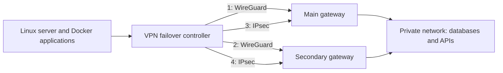

# VPN failover controller

A Docker service that keeps a Linux server and its applications connected to
a remote private network. It automatically chooses a working VPN connection
through one to four configured tunnels, using WireGuard, IPsec or a mixture.
You choose the priority order.

For example, a cloud application needs to reach a database inside your office.
If the primary gateway or its internet connection fails, the service moves
private-network traffic to the secondary gateway. If WireGuard stops passing
traffic, it can use IPsec instead. Once a preferred path is consistently healthy,
it switches back automatically.

**v0.3.0 development:** adds flexible tunnel lists. See [configuration layouts](CONFIGURATION.md#choosing-a-layout).

**Previous v0.2.0:** functional tests, hosted CI and the requested
12-hour observation passed. One application ping needed a retry, and controller
logs recorded brief probe warnings without a route switch. See
[validation report and limits](VALIDATION_CANDIDATE.md), including the initial
failed observation and the limits of the test setup.
The earlier published release has a separate [v0.1.0 report](VALIDATION.md).
This source release is not an automatic upgrade of an existing deployment.

## Who it is for

- Teams running a cloud application that must reach office databases, APIs or other private servers.
- Administrators who want a second gateway when the primary VPN path fails.
- Sites that need IPsec as a fallback when WireGuard connectivity is interrupted.

It manages one configured private IPv4 network prefix and one to four paths.
It does not provide a remote-user VPN portal, configure MikroTik routers,
replace a site's internet failover router or guarantee uninterrupted application
sessions. Every configured gateway must be able to reach the chosen private network.
A shared failed switch, database or power supply cannot be repaired by changing VPN paths.

## Where it runs

| Location | Suitability |
| --- | --- |
| Linux VPS or cloud VM | Intended deployment location, provided you have root access, Docker and the required kernel networking features. |
| Linux server or dedicated Linux VM on premises | Possible with the same requirements and reachable remote gateways; validate your own host first. |
| Portainer-managed Linux Docker host | The Compose service can be managed there after its configuration, mounts and host requirements are prepared. Portainer is optional. |
| MikroTik router | The router is a VPN gateway. This Python/Docker service runs on Linux, not RouterOS. |
| Windows or macOS / Docker Desktop | Useful for editing or unit tests; host-network VPN deployment is not validated there. Use a separate Linux host. |
| Unprivileged shared hosting | Unsuitable: the service needs permission to manage Linux routes, interfaces and firewall rules. |

The image uses strongSwan for IPsec, Linux WireGuard tools, a small Python
controller and a supervisor. Docker packages these components into one service.
The supplied Compose file uses the Linux host network: the container changes
host routes and selected firewall rules. It is not isolated from host networking.
Reserve its networking resources and test on a dedicated host before installing
it beside critical applications or another VPN service.

## Example network layout



All configured tunnels are monitored; one path carries the selected private-network
route. The server's ordinary public internet and SSH use its existing default
route. Optional inbound TCP publication allows a private-network client to call
a configured Docker application port, with replies sent through the same tunnel.
Access still depends on your gateway and host firewall rules.

## What you need before deployment

1. A Linux host with Docker Engine and Compose, root access, IPv4 forwarding,
   WireGuard support when using WireGuard, and XFRM interfaces when using IPsec. Docker must provide the
   `DOCKER-USER` firewall chain.
2. Reachable VPN gateways supporting the protocols you configure. One physical MikroTik plus a Linux secondary has been
   tested; two physical MikroTiks and every RouterOS release have not.
3. Matching gateway peers, keys, IPsec identities, encryption proposals,
   firewall permissions and routes to the private network. Router setup is manual.
4. Two or more reliable internal hosts that answer the configured ping probes,
   separate non-overlapping tunnel/application networks and unused routing IDs.
5. A reviewed rollback and console access before changing a critical host.

The example limits the container to 256 MiB RAM. It passed the functional test
workload at that limit; this is not a throughput or production-capacity guarantee.

## Installation outline

Start on a separate Linux test host. Installation is a network configuration
task, not simply starting an image with its example values.

1. Download the chosen release's source archive from GitHub and extract it.
2. Copy `config/examples` to `config/local`; replace placeholders using the
   [configuration guide](CONFIGURATION.md). Create private keys and configure
   matching peers on both gateways. Set the configuration directory to mode
   0700 and credential files to 0600.
3. Prepare the host forwarding, firewall and kernel requirements. Create
   `/run/vpn-router` with mode 0700 and make sure no other service uses the
   reserved interfaces, rules, tables or IPsec UDP listeners.
4. Build the image and run the read-only prerequisite check while the service
   is stopped. Resolve errors before starting it.

```sh
docker compose build
docker compose run --rm --entrypoint python3 vpn-router /app/doctor.py
docker compose up -d
docker exec vpn-router python3 /app/status.py
docker logs --since 10m --timestamps vpn-router
```

5. Verify application traffic, each standby path, failover and recovery in the
   test environment. Confirm public SSH and the host default route still work.
   Adopt it on a production host only after reviewing the results and rollback.

Stopping the container does not remove all created host-network resources.
`docker compose down` alone is not a complete network rollback.

## How it works

The example order is **WireGuard main → WireGuard secondary → IPsec main →
IPsec secondary**. Your `paths` list defines the order; protocols have no hidden
priority. All configured paths are checked, including standby paths. Each
check uses that tunnel's own source address and routing table.

The example checks three internal IP addresses every two seconds and requires
two answers. Eight failed rounds trigger a move away from the current path.
Thirty healthy rounds allow return to a preferred path. These correspond to
roughly 16 seconds and 60 seconds; command delays can make them longer.
A short failed check alone does not cause a switch. When every path is down,
the managed internal prefix is unreachable instead of falling through to WAN.

The controller changes the route for the configured internal prefix. It does
not replace the server's public default route. Existing application connections
may need to reconnect after a path change. Host networking and NET_ADMIN mean
that this container can change host networking: test installation separately.

## What the files do

| File | Plain-language purpose |
| --- | --- |
| `build/controller.py` | Checks the configured roads to the internal network and switches the selected route when needed. |
| `build/selection.py` | Makes the priority and waiting-time decision without touching the network. |
| `build/configuration.py` | Checks settings and supports custom tunnel addresses, ports, MTU and waiting times. |
| `build/ipsec_config.py` | Builds matching IPsec traffic selectors from validated settings. |
| `build/doctor.py` | Checks whether installation prerequisites are ready without changing networking. |
| `build/status.py` | Explains active/standby paths, the last switch and recovery waiting time. |
| `build/setup.py` | Creates only the WireGuard/IPsec interfaces you configure. |
| `build/guard.py` | Validates settings, rejects conflicting routes and repairs the exact routes, NAT and TCP MSS rules owned by this service. |
| `build/supervisor.py` | Starts and watches the controller and, when configured, the IPsec daemon; records faults and delays repeated restarts. |
| `build/cleanup_ipsec.py` | Removes validated leftover IPsec kernel objects belonging to this service after a crash. It never flushes all IPsec state. |
| `build/health.py` | Tells Docker whether the controller, selected path and supervisor are healthy. |
| `build/eventlog.py` | Turns events into readable log messages. |
| `monitoring/kuma_push.py` | Reports each tunnel's status to Uptime Kuma. It cannot switch routes. |
| `build/strongswan.conf` | Configures the IPsec daemon and its private control socket. |
| `build/Dockerfile` | Describes how the container image is built. |
| `compose.yaml` | Describes how Docker starts the container, limits resources and mounts settings. |

The old `mss.py` and `nat-inbound.py` compatibility wrappers are omitted:
their work already belongs to `guard.py`. No backups or operational logs are included.

## Configuration and reserved resources

Copy `config/examples` to ignored `config/local` and edit the copies. Examples
contain documentation endpoints and placeholders, never usable credentials.
Generate separate WireGuard client keys and save them as `wg-client-a.key` and
`wg-client-b.key` in that local directory. Configure matching router peers.
`a` means secondary, `b` means main. Router configuration is not automated here.

`controller.json` defines the private internal prefix, probe targets, quorum,
thresholds and ordered paths. `deployment.json` defines the Docker application
subnet and optional inbound TCP publication. `publication: null` disables it.
If enabled, provide `address`, `port`, and `tunnel_port`; return traffic is marked
so it follows the incoming tunnel. `peers.json` contains router endpoints,
WireGuard public keys and ports. Legacy file mode uses `swan-client.conf` for
IPsec identities, matching proposals, traffic selectors and unique PSKs. Keep it private.
In the new `generated` IPsec mode, selectors follow controller settings and PSKs
come from private `ipsec-a.key` / `ipsec-b.key` files. See the full
[configuration guide](CONFIGURATION.md) for fields, compatibility and checks.

The example reserves the following layout; schema version 2 makes it configurable:

| Path | Interface | Client address | Routing table | XFRM ID |
| --- | --- | --- | --- | --- |
| WG main | vpn-wg-b | 10.250.102.2/30 | 202 | — |
| WG secondary | vpn-wg-a | 10.250.101.2/30 | 201 | — |
| IPsec main | vpn-ipsec-b | 10.251.102.2/32 | 203 | 102 |
| IPsec secondary | vpn-ipsec-a | 10.251.101.2/32 | 204 | 101 |

WireGuard router addresses are the `.1` addresses in the two /30s. The default
router listener in the examples is UDP 51889; clients listen on 52101/52102.
Reserve rule priorities 12201–12204, optional mark rules 12101–12104, marks
0x5c01–0x5c04 and route protocol 186. Do not share these IDs/interfaces/tables
with another VPN controller or IPsec daemon in the same host network namespace.
Changing the layout requires matching gateway changes and a reviewed migration
of any old reserved host resources. It does not require Python edits.

The host needs Docker's iptables `DOCKER-USER` chain, IPv4 forwarding, Linux
WireGuard and XFRM interface support. Review reverse-path filtering and host
firewall/UDP 500/4500 rules separately. This project does not configure them.
Do not run it alongside an existing controller that manages the same routes.

WG MTU is 1420 and IPsec MTU 1400; Docker TCP MSS caps are 1380 and 1360.
These are starting values, not guarantees for every provider path. Validate
path MTU separately. The managed subnet must not overlap application/tunnel ranges.

## Local checks and a separate test deployment

Run the non-networking checks from the repository root:

```sh
python3 -m unittest discover -s tests -v
python3 -m compileall -q build monitoring tests
```

To reproduce the encrypted mixed four-path integration suite on a dedicated Linux
test host with Docker and root access:

```sh
sudo python3 tests/integration_linux.py
```

For two/four WireGuard and two/four IPsec layouts with independent Linux
gateways, run this separate suite on the dedicated test host:

```sh
sudo python3 tests/integration_flexible.py
```

It builds this Dockerfile and starts two simulated Linux gateways, an application
container and the controller in new internal Docker networks. No host ports are
published and no live router is contacted. Disposable keys are generated locally
and removed with the test containers and networks on completion. The harness
checks failover/failback, all-path failure, application SNAT and negotiated TCP
MSS, inbound publication and pinned replies, restarts and IPsec crash recovery.
Do not run this root/Docker integration suite on production. `--keep` is only for
debugging: it deliberately retains test resources and temporary credentials.

For a separate test host only: prepare `config/local`, set restrictive file
permissions, reserve the resources above, and create `/run/vpn-router` with mode
0700. Then build and start using `docker compose build` and `docker compose up -d`.
Verify each path, all-path failure, failback, restart recovery, application traffic
and the unchanged public default route. Stopping the container retains routes;
it is not a complete network rollback. Prepare an explicit rollback before use.

Logs: `docker logs --since 30m --timestamps vpn-router`. Runtime status:
`/run/vpn-router/status.json` and `/run/vpn-router/watchdog.json` on the test host.
Event timestamps are rendered as MSK (UTC+3); Docker timestamps provide UTC.

Uptime Kuma reporting is optional and runs separately. Copy the example to a
private `kuma.json`, provide one push token per configured path, then run `kuma_push.py --config`
with that file from a trusted scheduler with read access to runtime status.
`--dry-run` prints classifications without sending heartbeats. The reporter's
debounce and target counts come from controller status. Update monitoring token
mapping keys if you rename paths.

Automated GitHub checks run unit tests and build the image using read-only
repository permissions. They have no deployment job or infrastructure credentials.
Longer isolated observation is available with `--soak-seconds 86400`; it must finish
successfully before its outcome is reported. Real RouterOS validation is separate.

See [strongSwan configuration documentation](https://docs.strongswan.org/docs/latest/swanctl/swanctlConf.html)
for the IPsec example fields. Actual router identities and proposals must match
your gateway; simulated Linux peers do not certify a vendor configuration.

## Publication boundary

No live configs, private keys, passwords, push tokens, operational logs, router
exports or server backups belong in Git. The repository does not contain hooks,
remote SSH automation or GitHub Actions that deploy anything. Source is licensed
under the [MIT License](LICENSE). Local unit tests verify decision logic and
safeguards. The isolated Linux integration suite verifies a simulated topology;
it does not certify every router, provider, kernel or long-running workload.

Prepared by **r.abdulkhalek**.
